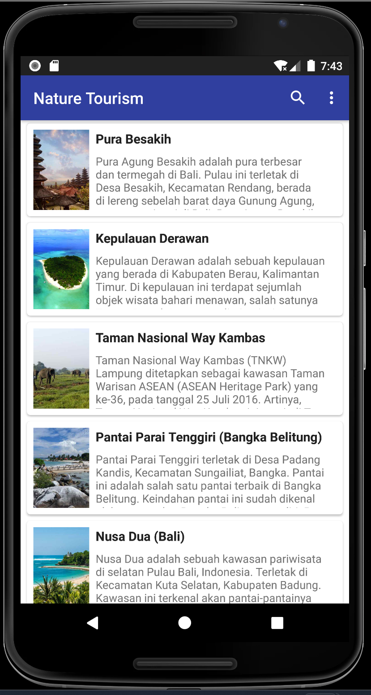
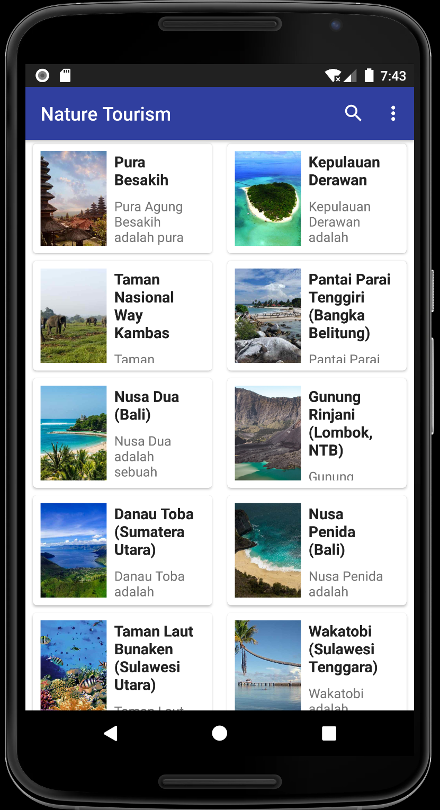
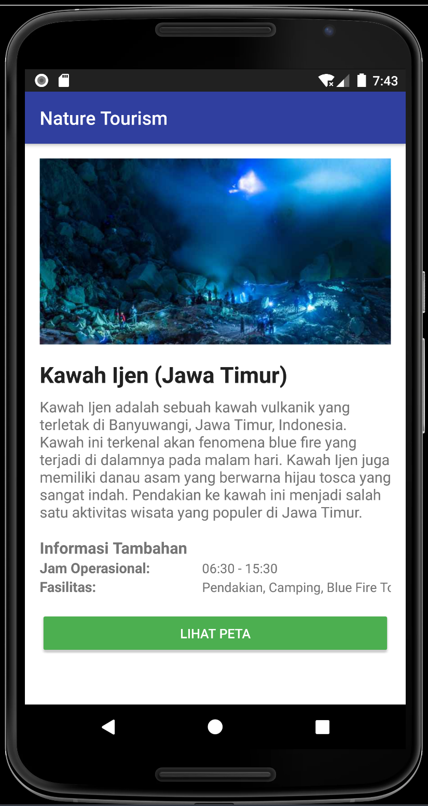

# Nature Tourism

Nature Tourism is an Android-based tourism application that provides comprehensive information and guidance about popular natural tourism destinations in Indonesia.

## Main Features

- List of 20 popular natural tourism destinations
- Detailed description of each location
- Interesting photo gallery
- Operating hours information
- Activity guide at the tourism sites
- Location map with Google Maps integration

## Technology

- Kotlin
- Android Studio
- RecyclerView
- ViewModel

## Screenshots

  

## Developer

Nature Tourism application is developed by Rahmad Era Sugiarto as a final project submission for the Android Programming course.
